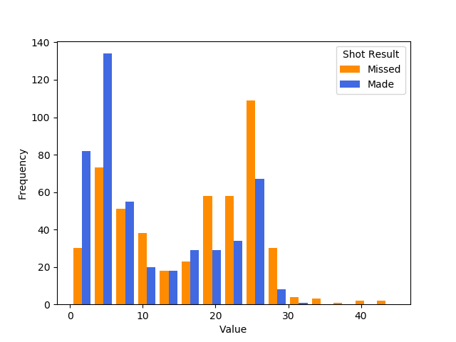

Report
================

A Classification Decision Tree for Lebron James's Shots
=======================================================

A project for UBC DSCI 522

Authors: Alex Hope, Jes Simkin Nov, 2018

Question
--------

Considering there are hundreds of players in the NBA with differing skillsets and styles of play, we narrowed our analyses to simply a single player, Lebron James. We did this to hopefully get at the nuances of what conditions best explain Lebron's shooting percentage and marvellous talent. Our question is a predictive one, namely, we are interested in using a set of measurements to predict another measurement about a single individual.

Our question for this analysis is:

**What are the three strongest predictors for determining whether Lebron makes or misses a shot?**

[GIF Source](https://media.giphy.com/media/l0MYwdebx8o0XI56E/giphy-tumblr.gif)

Exploring The Data
------------------

We have chosen 8 features in our dataset related to aspects of shooting that are numerical. To get a sense of the features and build our intuition around which are our top predictors, we explored the distribution of each feature grouped by shot result (made or missed).

Here are a few of the features we included in our analyses and their related histograms for their distributions.

### Figure 1. Closest Defender (ft):

  

### Figure 2. Number of Dribbles:

  

### Figure 3. Time on the Shot Clock (seconds):

  

### Figure 4. Shot Distance (ft):

  

Analysis
--------

### Figure 5. How our model performs:

  

### Figure 6. Top Three Features:

  

<a href="https://media.giphy.com/media/lKafiHISf6FEtciruw/giphy.gif">GIF Source</a>

Observations
------------

Our best tree depth was a depth of 6 with a test set accuracy of 59% for predicting whether Lebron James makes or misses a shot.

We were surprised by the limitations of our features in predicting whether Lebron makes a shot or not. At  accuracy for prediction, that's slightly more than a coin toss. One point we hadn't clearly thought about is that Lebron seems to be a strong shooter even when changes in these variables of interest happen. For instance, he is known for being an excellent long distance shooter and for making shots even when the defender is close by. Therefore, his targets are harder to predict because the reasons he misses aren't as cleanly captured given the features we have outlined here. We suspect that if another shooter was chosen who is not a perimeter shooter, and really only scores in and around the hoop, we may find some of these features to be more predictive of the target variable.

There may be other features that aren't captured in this dataset or have yet to be developed that help distinguish Lebron's makes and misses. While our analysis was limited in it's predictive power, this process has helped encourage us to think about feature development in new ways to measure the game that haven't been considered like fan noise, points the team is up or down when the shot was taken, and player stamina.

If we had more time, we could consider testing out other players to see whether our decision tree is able to differentiate targets more clearly. Can we get a better prediction rate with other players? Perhaps with players with a worse shooting percentage whose misses predictably occur through one of the features we have discussed?

There are lots of questions to explore in the future with this work, and we have learned a great deal from this process about the challenges of prediction, and the strengths/weaknesses of decision trees.

References
----------

-   Lebron James Shot Log from the 2014-2015 NBA Season. Raw Data Source: [Kaggle, NBA Shot Logs Dataset](https://www.kaggle.com/dansbecker/nba-shot-logs/home)
-   Data Analysis Pipeline Example by Tiffany Timbers for UBC DSCI 522 (2018) [Github Repo](https://github.com/ttimbers/data_analysis_pipeline_eg/tree/v1.1)
-   Feature Importance by Chris Albon [Blog Link](https://chrisalbon.com/machine_learning/trees_and_forests/feature_importance/)
