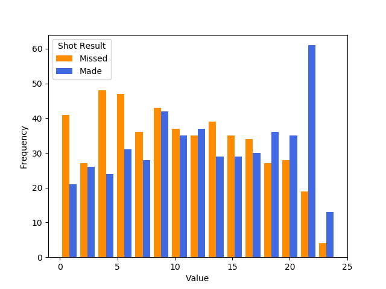

Report
================

A Classification Decision Tree for Lebron James's Shots
=======================================================

A project for UBC DSCI 522

Authors: Alex Hope, Jes Simkin Nov, 2018

Question
--------

Considering there are hundreds of players in the NBA with differing skillsets and styles of play, we narrowed our analyses to simply a single player, Lebron James. We did this to hopefully get at the nuances of what conditions best explain Lebron's shooting percentage and marvellous talent. Our question is a predictive one, namely, we are interested in using a set of measurements to predict another measurement about a single individual.

Our question for this analysis is:

**What are the three strongest predictors for determining whether Lebron makes or misses a shot?**

[GIF Source](https://media.giphy.com/media/l0MYwdebx8o0XI56E/giphy-tumblr.gif)

Exploring The Data
------------------

We have chosen to work with 8 features. To get a sense of the features and build our intuition around which might end up being top predictors, we explored the distribution of each feature, grouped by shot result (made or missed).

Here are a few features with distributions that might suggest they may be important in our model later on.

### Closest Defender (ft):

  

### Number of Dribbles:

  

### Time on the Shot Clock (seconds):

  

### Shot Distance (ft):

  

Analysis
--------

### How our model performs:

  

### Top Three Features:

  

<a href="https://media.giphy.com/media/lKafiHISf6FEtciruw/giphy.gif">GIF Source</a>

Observations
------------

Our best tree depth was a depth of 7 with a test set accuracy of 60% for predicting whether Lebron James makes or misses a shot.

We were surprised by the limitations of our features in predicting whether Lebron makes a shot or not. At 60% accuracy for prediction, that's slightly more than a coin toss.

It appears that there might be other features to consider, or that there's more to the game of basketball than can be encoded.

If we had more time, we might consider trying cross validation to pick a best depth for our decision tree. We might also consider testing out other players to see how our model lines up with other players. Can we get a better prediction rate with other players? Perhaps with players with a worse shooting percentage or players with a comparable shooting percentage?

References
----------

-   Lebron James Shot Log from the 2014-2015 NBA Season. Raw Data Source: [Kaggle, NBA Shot Logs Dataset](https://www.kaggle.com/dansbecker/nba-shot-logs/home)
-   Data Analysis Pipeline Example by Tiffany Timbers for UBC DSCI 522 (2018) [Github Repo](https://github.com/ttimbers/data_analysis_pipeline_eg/tree/v1.1)
-   Feature Importance by Chris Albon [Blog Link](https://chrisalbon.com/machine_learning/trees_and_forests/feature_importance/)
